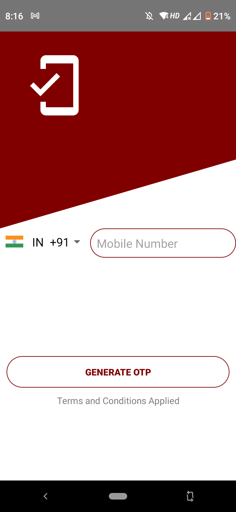
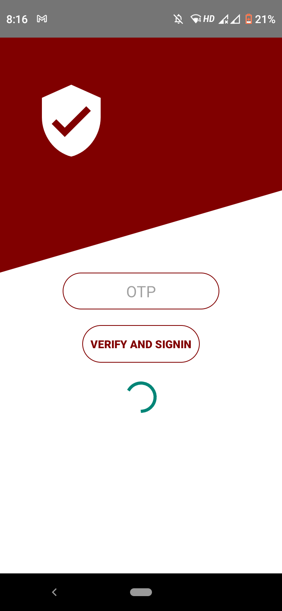
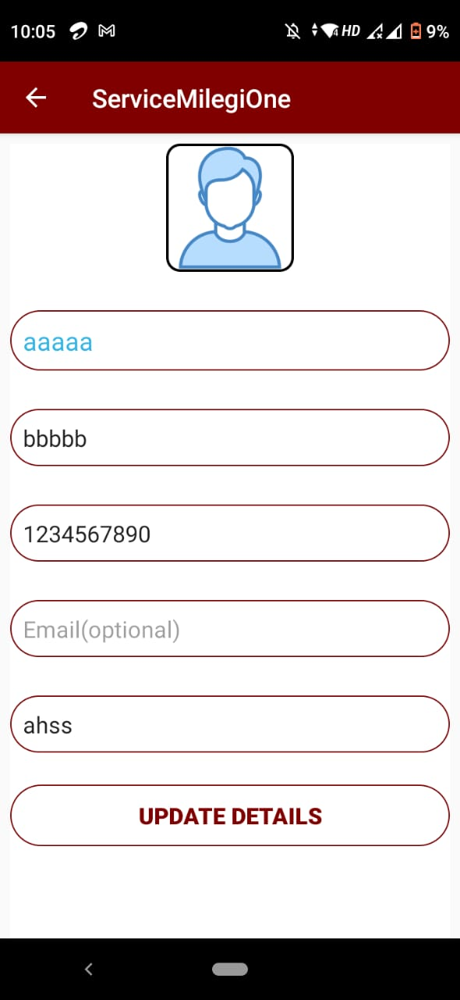
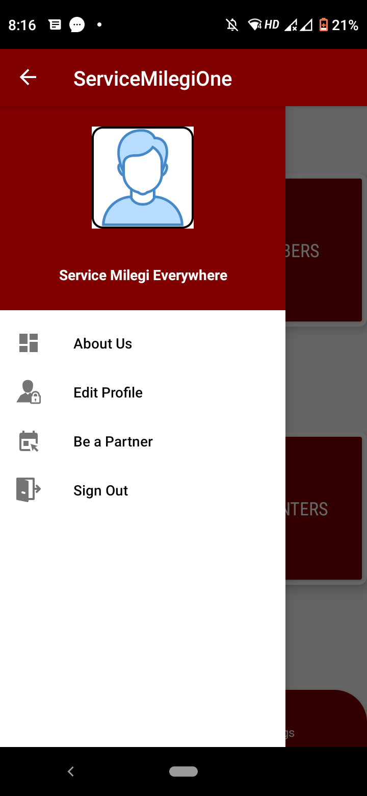
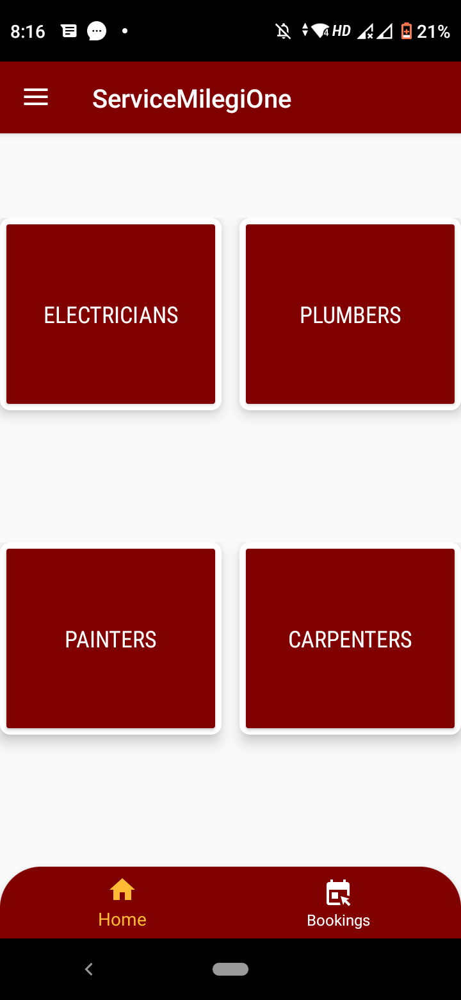
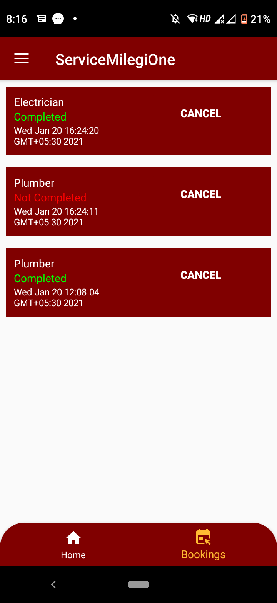
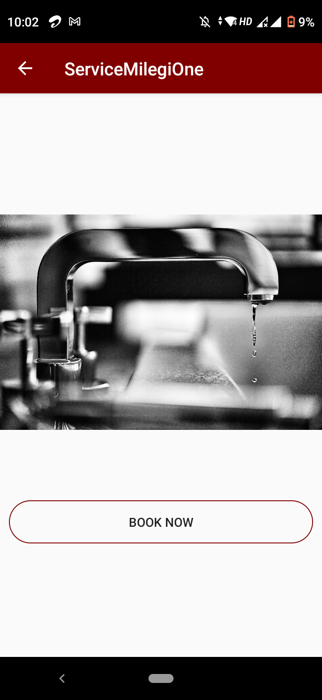
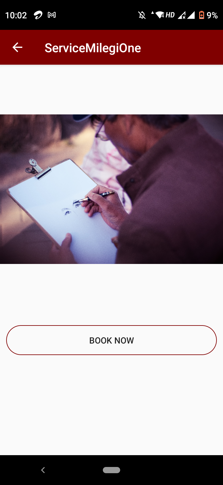
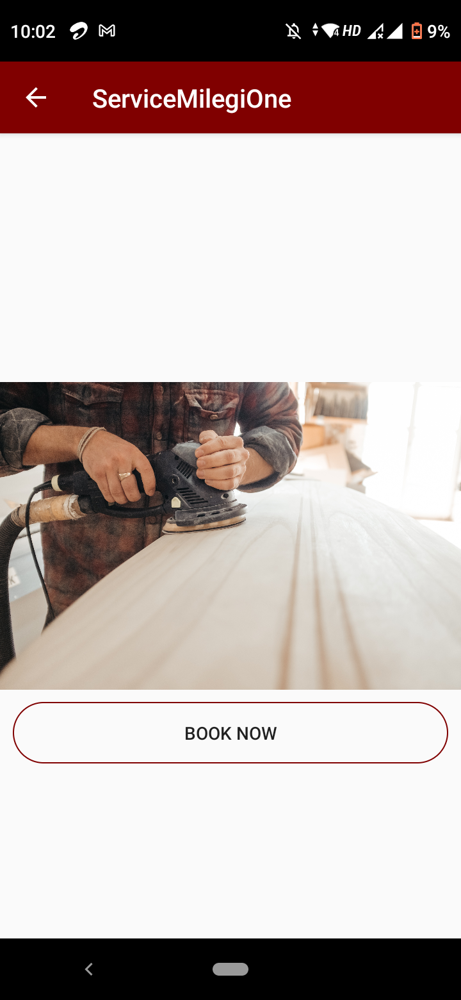
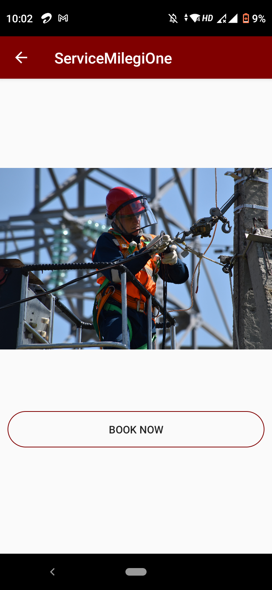

# Service Milegi Client App
Simple concept app made for providing day-to-day services such as : Electricians, Plumber , Carpenters etc. . 

### Contributer
Roshan Wazare <https://github.com/Rosh008>

 |  |  |  | |  |  |  |  | 
### App Features 

   * App uses mobile phone authentication method as a way to login into the app.
   * Users are required to enter their details the first time they sign in into the app and simultaneously app can perform CRUD operation on user data.
   * Depending on the need of user he can book a service from app while booking app asks for confirmation and the service is booked which is showcased in bookings. 
   * Till the client or the service provider doesn’t confirm the bookings from the client app the user can still cancel the booking via the cancel button from bookings fragment. Once confirmed from the client’s side, bookings can’t be canceled.

      
### Dependencies Used
   * Firebase Auth – used for mobile based authentication service.
   * Firebase Firestore –  database which is used to store and perform operations on all of the users data like personal details , orders etc.

### Concepts Covered
   * Fragments
   * Navigation Drawers
   * Firebase Auth and Firestore for android
   * DAO
   * ViewPager
   * RecycleView
   * Firestore Recycle Adapter
   * No Sql Database design
   * Intent
   * User-Permissions
   * Layout Design (XML)
   * Dialog Box
   * Toast Messages
   
